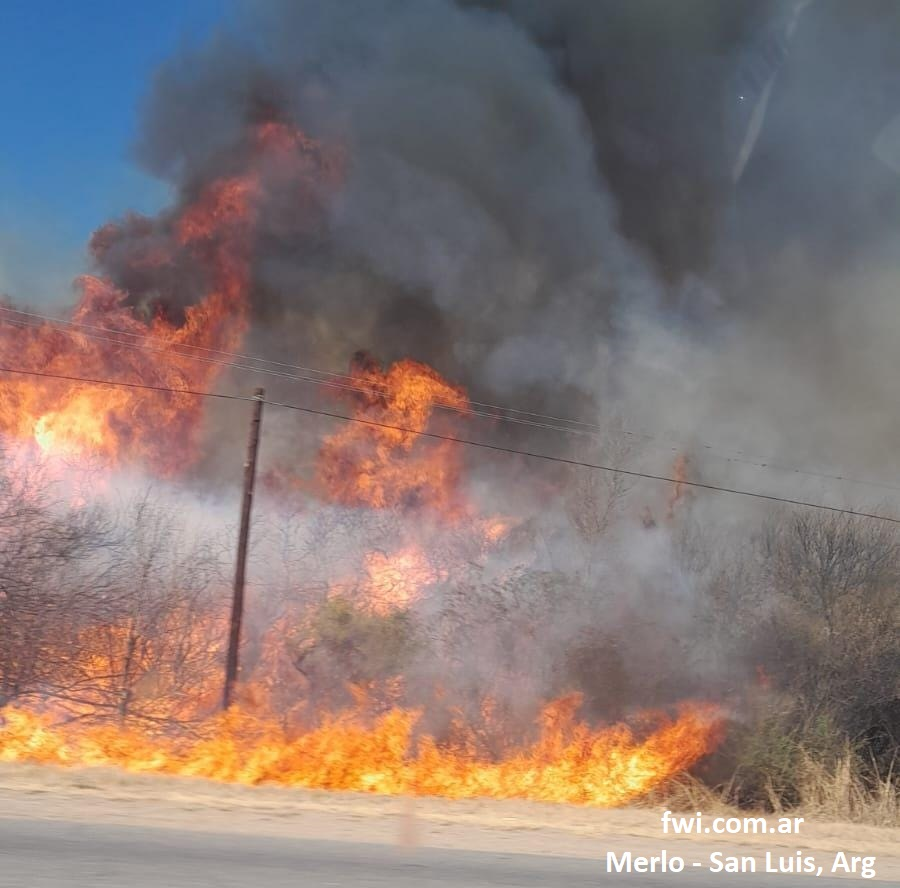

<table>
<tr>
<td><h1>Proyecto fwi.com.ar</h1></td>
<td align="right"></td>
</tr>
</table>

## 👀 ¿Qué es y para qué sirve? 
Este proyecto tiene como objetivo procesar datos meteorológicos proporcionados por el [Servicio Meteorológico Nacional](https://www.smn.gob.ar/) , para calcular índices relacionados con el Fire Weather Index `(FWI)`. Estos índices son esenciales para evaluar las condiciones de `riesgo de incendios forestales`, facilitando la toma de decisiones en `prevención` y `respuesta a emergencias`.

## ¿Para quién es? 
En este proyecto se busca crear una `herramienta gratuita` para profesionales como `bomberos` o `brigadas`, `estudiantes`, `aficionados` por la meteorología, y personas en general.

## 💡 Beneficios clave para el usuario 
* `Información`: La pagina brinda de manera intuitiva datos como: FWI, Temperatura, Humedad, Precipitaciones, Viento.    
* `Eficiencia`: Automatiza tareas repetitivas y permite enfocarse en el análisis de resultados.
* `Precisión`: Utiliza fórmulas estándar para garantizar la calidad de los índices calculados.
* `Confiabilidad`: Los datos se guardan de manera incremental. Asegurando el registro historico en el los calculos de cada día
* `Estadísticas`: Los datos historicos están disponibles para ser consultados

## 🔥 Indice FWI 
El `Fire Weather Index` (FWI) es un sistema internacionalmente reconocido para evaluar el riesgo de incendios forestales, basado en condiciones meteorológicas. Este índice combina factores claves como la temperatura, la humedad, el viento y las precipitaciones recientes, junto con una serie de cálculos que simulan el comportamiento del fuego en distintas condiciones.

El FWI no solo mide el riesgo de que ocurra un incendio, sino también su `intensidad` y `rapidez de propagación`, `disponibilidad de combustible fino y grueso`, proporcionando información esencial para la planificación, prevención y respuesta a emergencias relacionadas con incendios forestales.

Todos los calculos utilizados se basan en las formulas matemáticas que se utilizan internacionalmente.

## Explicación de los componentes del FWI

* `FFMC` (Código de Humedad del Combustible Fino): Representa el contenido de humedad de hojas secas y combustibles ligeros. Un valor bajo indica mayor humedad y menos riesgo de ignición, mientras que un valor alto sugiere que estos combustibles son más propensos a encenderse y propagarse rápidamente.

    ---

* `DMC` (Código de Humedad): Indica el contenido de humedad en combustibles medios.

    ---

* `DC` (Código de Sequía): Evalúa la humedad de capas profundas y compactas de suelo orgánico y troncos grandes. Este indicador refleja los efectos acumulativos de la sequía y ayuda a estimar la cantidad de combustión latente en materiales más densos.

    ---
* `ISI` (Índice de Propagación Inicial): Predice qué tan rápido podría propagarse un incendio, basado en la velocidad del viento y el FFMC. Este índice no considera el tipo de vegetación, por lo que la velocidad real de propagación puede variar dependiendo del entorno.

    ---
* `BUI` (Índice de Acumulación de Combustible): Evalúa la cantidad de material combustible disponible para quemarse, combinando los datos del DMC y el DC. Indica si el incendio podría mantenerse en capas más profundas de combustible.

    ---
* `FWI` (Índice Meteorológico de Incendios): Es un indicador de la intensidad del incendio. Se calcula usando el ISI y el BUI, y proporciona un panorama general del peligro de incendios en áreas forestales.

---

## ⚙ Características principales del proyecto 
* Actualización diaria: Los datos meteorológicos se actualizan automáticamente todos los días a las `15hs Arg`.
* Consulta interactiva: Muestra estadísticas históricas y predicciones basadas en cálculos.
* Mapa visual: Los resultados se pueden visualizar en un mapa para facilitar la interpretación.

## Página Web
[Ir a la página](https://www.fwi.com.ar)

### Inicio:
* Al abrir la pagina, te encontrarás con un `mapa interactivo` y un menú de barras para más información en la parte superior.
    

    ---

### Escala: 
* En la parte `inferior izquierda` encontramos la escala utilizada para interpretar el fwi, relacionando su valor con una palabra del tipo de riesgo. Y también la `fecha` de la cual se están visualizando los datos.
Tener en cuenta que se los resultados se pueden interpretar distinto según la región, por ejemplo `en la Patagonia no significa lo mismo 20 de fwi que en Misiones`. Entonces la escala en relación a el riesgo (bajo, moderado, alto, muy alto y extremo) `varía según la provincia`
    

    ---

### 🔝 Ranking FWI: 
* En la parte `inferior derecha`, encontramos un `ranking` de las provincias con mayor indice FWI, tener en cuenta que se toma el valor maximo por provincia para este calculo. Recordar mirar la fecha de los datos en la parte inferior izquierda
    

    ---

### Cuadrantes:
* Se divide al territorio argentino por `cuadrantes de 15km`, tomando el punto central al cuadrado para la medición meteorologica. Cada uno de estos se `colorea automaticamente` en base a su escala FWI. Y al hacerle click nos muestra su información. (Al hacer click en "Más Info" nos redirigirá a un dashboard interactivo de ese punto con datos historicos y modelos predictivos)
    

---

### Dashboard: 
* Aquí podremos `visualizar e interpretar` distintos graficos sobre la información historica de cada punto.
    

---

### Escalabilidad:
* Los datos tratados abarcan toda la zona del mapa, pero se colorea y publica solo la zona de Argentina, de todos modos se puede tratar los países limitrofes con el mismo metodo internacional.
    

___

## 📃 Descargo de responsabilidad: 

* `fwi.com.ar` no es un medio de información oficial, sino un proyecto independiente desarrollado por bomberos voluntarios.
* Los resultados deben utilizarse como una referencia complementaria y no como una fuente única para la toma de decisiones.
* El equipo de desarrollo no se responsabiliza por errores en los cálculos ni por el uso indebido de la información proporcionada.
### Recomendación:
Se sugiere contrastar los datos con fuentes oficiales y otros modelos meteorológicos antes de utilizarlos en la toma de decisiones relacionadas con la prevención o respuesta a incendios forestales.

---

## 🛠 &nbsp;Stack Tecnológico

---

## Fuentes:
- [Servicio Meteorológico Nacional](https://www.smn.gob.ar/)
- [Canadá](https://cwfis.cfs.nrcan.gc.ca/background/summary/fwi)
- [Structure of the Canadian Forest Fire Weather Index, by
C. E. Van Wagner](https://citeseerx.ist.psu.edu/document?repid=rep1&type=pdf&doi=6eb255d878bc0cead1cac0b96304ed8980349042)
- [Food and Agriculture Organization of the United Nations (FAO)](https://www.fao.org/4/XII/0738-B3.htm)
- [Manual Ministerio de Ambiente Arg.](https://drive.google.com/file/d/115Ob64dnTYDipzYPPfd-J_sI5cE6y8qt/view?usp=sharing)

## Proyecto realizado por:
* `Project Manager, y Data Scientist:` [Matias Oviedo](https://github.com/matiasoviedo28), 👨‍🚒 Bombero Voluntario de Merlo, San Luis, Arg
* `Asesor:` [Alexis Lezcano](https://www.instagram.com/alexis.lezcano.794?igsh=Z3RrcWdnaTYxZHBo), 👨‍🚒 Bombero Voluntario de Merlo, San Luis, Arg
