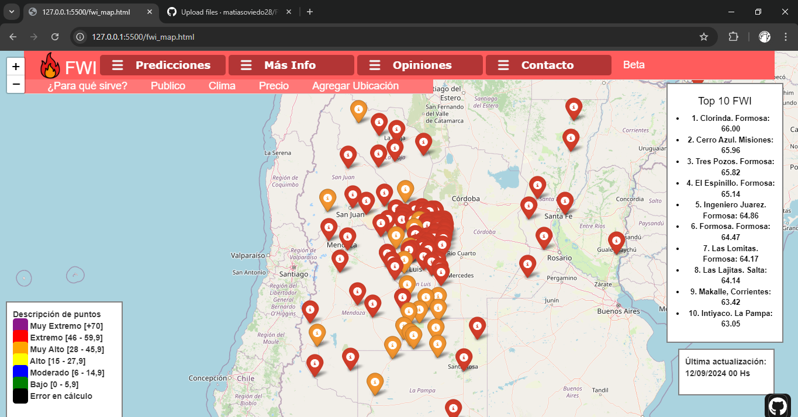
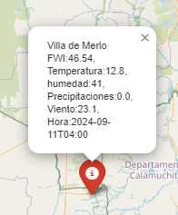
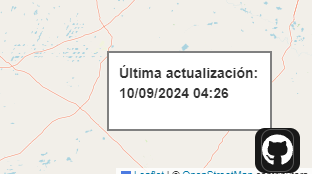

# Proyecto para calcular el riesgo de incendios forestales

En agosto de 2024 me encuentro con la problematica de que hay pocas herramientas publicas de facil acceso para obtener un indice como el FWI, aunque hay otras plataformas que simplifican la información mostrando el riesgo como (normal,alto,extremo). No hay ninguno gratuito para el uso de profesionales como los Bomberos Voluntarios quienes comunmente no tienen recursos para acceder a programas y aplicaciones de pago.

Este proyecto está en versión beta y por lo tanto está a prueba, sus datos no deben considerarse como 100% certeros, mientras sea una **versión beta** se recomienda comparar los datos con otras plataformas.
Se abren formularios para que los usuarios puedan valorar la herramienta, dar comentarios o sugerir mejoras. Así mismo invito a los profesionales en el tema a poner comentarios en la pagina web. 

### Indice:
* Objetivo
* Explicación del calculo FWI
* Cálculo del FWI
* Formulas Utilizadas
* Obtención de Datos y Visualización en el Mapa
* Explicación visual lograda

## Objetivo

Brindar una **herramienta gratuita**, de facil acceso, con posibilidad se servir a profesionales en la prevención y lucha en incendios forestales.

## Explicación del Cálculo del FWI 

El Índice de Riesgo de Incendio (FWI) es una medida que evalúa el riesgo de incendio forestal basado en las condiciones meteorológicas. Para calcular el FWI de diferentes ubicaciones, obtenemos datos meteorológicos específicos como temperatura, humedad, precipitación y velocidad del viento.

## Cálculo del FWI

El cálculo del FWI se realiza mediante una serie de fórmulas matemáticas que combinan estos datos. Primero, calculamos tres índices precursores: el Índice de Combustible de Finos (FFMC), el Índice de Humedad de Combustible (DMC) y el Índice de Humedad de Combustible Profundo (DC). Estos índices se obtienen mediante la suma y multiplicación de parámetros meteorológicos, ajustados según una fórmula específica. El FWI final se obtiene sumando estos tres índices y ajustándolo según la velocidad del viento.

### Formulas Utilizadas:

* H = Humedad
* T = Temperatura
* V = Velocidad del viento
* P = Precipitación
* FFMC = Indice de Humedad de Combustible Fino
* DMC = Índice de Humedad del Manto Intermedio
* DC = Índice de Sequedad
* FWI = Índice de Peligro de Incendios Forestales

1) FFMC = 0,4 x H + 0,6 x (T/2)

2) DMC = 0,5 x H + 0,3 x (T/2)

3) DC = 0,2 x P + 0,5 x T

4) FWI = FFMC + DMC + DC + 0,1 x V

El FWI debería ser mayor a 0 y menor a 100

Fuentes del metodo de calculo para el FWI:
[Canadian Forest Service](https://cwfis.cfs.nrcan.gc.ca/background/summary/fwi)

## Obtención de Datos y Visualización en el Mapa

Los datos meteorológicos se obtienen a través de una API a travez de la web que actualiza la información cada hora. Utilizamos estos datos para calcular el FWI con las formulas previamente definidas y luego visualizamos los resultados en un mapa interactivo HTML. Cada ubicación se marca en el mapa con un color que representa el nivel de riesgo de incendio, en cada punto al hacer click en el, se podrán ver sus datos meteorologicos. El mapa también incluye una leyenda en la esquina izquierda que indica el significado de cada color, proporcionando una representación clara y accesible del riesgo de incendio en diferentes áreas.
También contamos con un ranking top 10 puntos con mayor.
Las coordenadas de cada punto fueron definidas manualmente, y se pueden sugerir cambios o implementar nuevos puntos desde los formularios de la parte superior.

### Explicación visual lograda:

